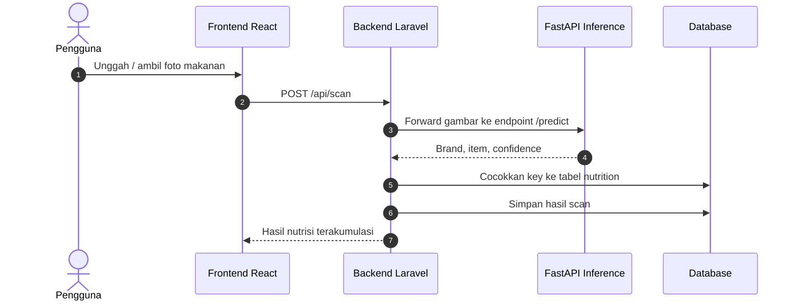

# NutriVision - Sistem Analisis Gizi dan Deteksi Makanan Berbasis AI

NutriVision adalah aplikasi web yang membantu pengguna mencatat asupan makanan melalui pemindaian foto, perhitungan nutrisi, riwayat konsumsi, dashboard progres, dan chatbot gizi. Proyek ini menggabungkan Laravel, React, dan layanan inference berbasis TensorFlow/FastAPI untuk mendeteksi brand serta item makanan dari gambar.

## Gambaran Singkat

Fokus utama aplikasi:

- scan makanan dari foto
- identifikasi brand dan item makanan
- pencocokan ke database nutrisi
- akumulasi kalori dan makronutrien
- penyimpanan riwayat konsumsi
- chatbot nutrisi untuk edukasi dan tanya jawab ringan

Saat ini model dipakai untuk kebutuhan aplikasi NutriVision, terutama alur scan makanan pada backend Laravel. Repository ini belum menyediakan SDK atau package integrasi model yang generik untuk aplikasi lain.

## Teknologi Utama

1. Laravel 13 untuk backend, autentikasi, API, dan penyimpanan data.
2. React + TypeScript + Inertia.js untuk antarmuka web.
3. Tailwind CSS untuk styling antarmuka.
4. TensorFlow + FastAPI untuk inference model AI.
5. Hugging Face Hub/Space untuk distribusi model siap pakai dan endpoint inference.
6. Groq API untuk chatbot nutrisi.

## Arsitektur Singkat



## Mekanisme Model di Aplikasi Ini

Di NutriVision, model tidak dipanggil langsung dari frontend. Mekanismenya berjalan seperti ini:

1. Pengguna mengunggah gambar makanan dari aplikasi.
2. Laravel menerima file melalui endpoint `POST /api/scan`.
3. `ScanController` meneruskan file gambar ke layanan inference FastAPI.
4. Layanan inference menjalankan dua tahap prediksi:
   - klasifikasi brand makanan
   - deteksi item makanan pada gambar
5. Hasil prediksi dikembalikan sebagai JSON, lalu Laravel mencocokkan label hasil model ke tabel `nutrition`.
6. Backend menghitung total kalori, lemak, karbohidrat, dan protein berdasarkan `serving_qty`.
7. Hasil scan disimpan ke database dan dikirim kembali ke frontend.

### Komponen model yang dipakai

Berdasarkan implementasi di [inference.py](/d:/Kuliah/Bootcamp/DBS%20CC26/Capstone%20Project/nutrivition-071/inference.py):

- model diunduh dari Hugging Face dengan `snapshot_download`
- `brand_map.json` dan `item_map.json` dipakai untuk mapping kelas
- `brand_saved_model` dipakai untuk klasifikasi brand
- `menu_saved_model` dipakai untuk deteksi item makanan
- hasil deteksi dipost-process dengan threshold per kelas dan Non-Maximum Suppression

### Output inference

Endpoint inference mengembalikan struktur data seperti:

```json
{
  "brand": "mcd",
  "brand_score": 0.98,
  "items": [
    {
      "label": "mcd-frenchfries",
      "score": 0.91,
      "box": {
        "y1": 0.12,
        "x1": 0.20,
        "y2": 0.76,
        "x2": 0.88
      }
    }
  ]
}
```

Label seperti `mcd-frenchfries` lalu dicocokkan oleh Laravel ke kolom `key` pada tabel nutrisi.

### Integrasi backend saat ini

Berdasarkan implementasi di [app/Http/Controllers/Api/ScanController.php](/d:/Kuliah/Bootcamp/DBS%20CC26/Capstone%20Project/nutrivition-071/app/Http/Controllers/Api/ScanController.php):

- backend memanggil endpoint inference `https://galihkjaya-nutrivision-api.hf.space/predict`
- file dikirim sebagai multipart upload
- bila hasil model kosong atau tidak cocok dengan database nutrisi, backend mengembalikan error yang sesuai
- bila lebih dari satu item terdeteksi, backend mengakumulasikan seluruh nutrisi menjadi satu hasil utama untuk UI

### Batasan saat ini

- model saat ini diposisikan untuk mendukung alur aplikasi NutriVision
- dokumentasi integrasi saat ini berfokus pada backend Laravel ke layanan inference
- belum ada package resmi untuk integrasi mobile, desktop, atau aplikasi pihak ketiga
- dukungan item/brand mengikuti model dan data nutrisi yang tersedia di proyek ini

## Sumber Model

### Google Drive Full Model Assets

Untuk aset model lengkap dan file mentahan pelatihan, gunakan Google Drive berikut:

<https://drive.google.com/drive/folders/18IcDLcms48ljtpJn9aMkk88pGsJ2TkbT?usp=sharing>

Isi folder ini ditujukan untuk kebutuhan seperti:

- artifact training mentah
- `tfrecord`
- `saved_model`
- file pendukung eksperimen dan reproduksi training

Folder Google Drive ini lebih cocok untuk riset, audit eksperimen, dan kebutuhan pengembangan model.

### Hugging Face Ready-to-Use Models

Untuk model yang siap dipakai atau di-download langsung untuk inference, gunakan repository berikut:

<https://huggingface.co/galihkjaya/nutrivision-models>

Repository Hugging Face ini dipakai oleh implementasi `inference.py` untuk mengambil:

- `brand_map.json`
- `item_map.json`
- `brand_saved_model`
- `menu_saved_model`

Jika tujuan Anda adalah menjalankan inference seperti yang dipakai aplikasi, Hugging Face adalah sumber yang paling praktis.

## Folder `ml-model`

Folder [ml-model](/d:/Kuliah/Bootcamp/DBS%20CC26/Capstone%20Project/nutrivition-071/ml-model) disediakan untuk artefak pengembangan model yang aman disimpan di repository aplikasi tanpa membawa file model besar ke deployment web.

Isi utamanya:

- `requirements.txt` untuk environment Python model
- notebook training/eksperimen yang digunakan dalam pengembangan model

Catatan:

- file model besar, dataset, `tfrecord`, dan artifact training lengkap tetap lebih aman disimpan di Google Drive atau Hugging Face
- pendekatan ini menjaga repository aplikasi tetap ringan untuk deployment Laravel Cloud

## Chatbot yang Digunakan

NutriVision juga memiliki chatbot bernama `NutriBot AI` yang tersedia di antarmuka web.

### Cara kerja chatbot

Berdasarkan implementasi di [resources/js/components/AiChatbot.tsx](/d:/Kuliah/Bootcamp/DBS%20CC26/Capstone%20Project/nutrivition-071/resources/js/components/AiChatbot.tsx) dan [app/Http/Controllers/ChatController.php](/d:/Kuliah/Bootcamp/DBS%20CC26/Capstone%20Project/nutrivition-071/app/Http/Controllers/ChatController.php):

1. Frontend mengirim pesan pengguna ke endpoint `POST /api/chat`.
2. Backend Laravel menyusun system prompt khusus NutriVision.
3. Backend memanggil Groq Chat Completions API.
4. Sistem mencoba beberapa model fallback:
   - `llama-3.3-70b-versatile`
   - `llama-3.1-8b-instant`
   - `gemma2-9b-it`
5. Respons chatbot dikirim kembali ke frontend dan ditampilkan di panel chat.

### Fungsi chatbot

Chatbot digunakan untuk:

- edukasi nutrisi dan kalori
- penjelasan cara kerja NutriVision
- saran umum terkait makronutrien, diet, dan aktivitas
- personalisasi ringan berdasarkan riwayat scan pengguna yang login

### Guardrail chatbot

Chatbot saat ini dibatasi untuk topik:

- nutrisi makanan
- kalori dan makronutrien
- saran diet/aktivitas umum
- informasi tentang aplikasi NutriVision

Backend juga menerapkan pembatasan prompt agar chatbot tidak keluar dari konteks tersebut.

## Instalasi Lokal

### Prasyarat

- PHP `>= 8.3`
- Node.js `>= 20`
- Composer `>= 2`
- SQLite, PostgreSQL, atau MySQL

### Menjalankan aplikasi

```bash
git clone https://github.com/ridhwananang/nutrivition-071.git nutrivision
cd nutrivision
composer install
npm install
cp .env.example .env
php artisan key:generate
```

Buat database SQLite lokal:

```bash
New-Item -Path "database" -Name "database.sqlite" -ItemType "file" -Force
php artisan migrate --seed
```

Jalankan mode pengembangan:

```bash
npm run dev
```

## Menjalankan Inference Service Secara Lokal

Jika ingin mencoba layanan inference yang selaras dengan alur aplikasi:

1. Siapkan environment Python terpisah.
2. Install dependensi dari `ml-model/requirements.txt` atau environment inference yang sesuai.
3. Jalankan service FastAPI:

```bash
python inference.py
```

Secara default service akan berjalan di port `7860`.

Jika ingin menghubungkannya ke aplikasi secara lokal, endpoint pada `ScanController` perlu diarahkan ke service lokal tersebut.

## Testing

Untuk menjalankan test backend:

```bash
php artisan test
```

## Catatan Deployment

Penambahan folder `ml-model` di repository ini ditujukan untuk dokumentasi dan aset ringan seperti notebook dan daftar dependensi. Folder ini tidak dipakai langsung oleh runtime web Laravel kecuali Anda menambahkan integrasi baru yang memang memanggil isinya.
